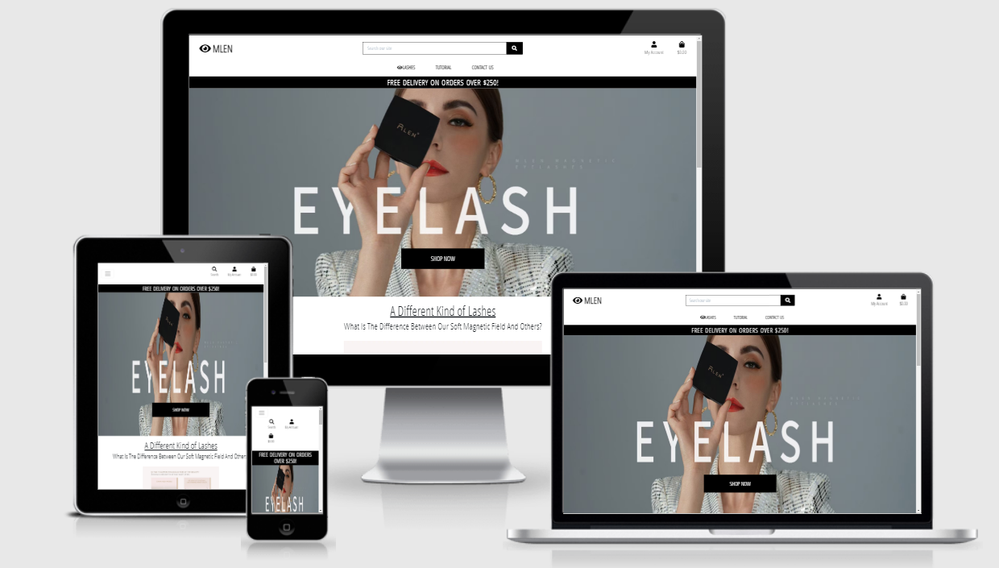

# [MLEN](https://tanya-mlen.herokuapp.com/) 

This is the 4th Milestone project undertaken as part of Code Institute and has been build in the Full Stack Framework using Django.

MLEN is an online store for anyone who have interest in magnetic eyelashes.
MLEN eyelashes can be reuseable, wear and remove in seconds! Natural soft magnetic eyelashes with various designs for you to complete your beauty. It is currently the most advanced magnetic eyelash.

## Design

***Color Theme***

The main colours used are Black and Canva to keep the site clean and balance with white background and brighter tones.

***Font***

'Open Sans Condensed' for all the fonts in the site.

***Wireframe***
[Desktop (Tablet is the same as desktop ver) and Mobile Wireframe.](./readme/mlen.pdf).

## UX

***User Stories***

- As a **user**, I want to be able to register for an account.
- As a **user**, I want to be able to log on and off the site after I have registered.
- As a **user**, I want to be able to recover my password if I no longer remember it.
- As a **user**, I want to receive confirmation emails throughout the registration process.
- As a **user**, I want to have a interactive personalized user profile.
- As a **user**, I want to be able to view all the products.
- As a **user**, I want to be able to view products by Sorting a specific category of product.
- As a **user**, I want to be able to search products by name.
- As a **user**, I want to be able to see more detailed product information.
- As a **user**, I want to be able to easily view the total of my purchases anytime.
- As a **user**, I want to be able to add products to my cart easily.
- As a **user**, I want to be able to Add a review for a specific product.
- As a **user**, I want to be able to view the items in my cart.
- As a **user**, I want to be able to adjust the quantity of items in my cart.
- As a **user**, I want to be able to easily enter my payment details.
- As a **user**, I want to be able to view an order confirmation after checkout.
- As a **user**, I want to be able to receive an email confirmation after checking out.
- As a **user**, I want to be able to send an email to the site.
- As a **site owner**, I want to be able to Add a product to the site.
- As a **site owner**, I want to be able to Edit a product to the site.
- As a **site owner**, I want to be able to Delete a product from the site.

## Features and Functionality

***Elements Across the website***

Nav bar is fixed at the top for easier navigation and footer is fixed at the bottom
for social media. On smaller device, the nav bar will be compressed into a side slide
menu which can be open by clicking on the down arrow button.

***Home Page Elements***

A hero Image on top in-tune with the theme of the project with a button which takes the user to the products page and a writeup about the brand.

***Tutorial Elements***

A static page to explain how to apply and clean the eyelashes.

***Contact Us Page Elements***

This page displayes a form for both the user and non-user to send an email. By submitting the form, the email will be sends to the DB.

***Login Page Elements***

Registered user can input their username and password info to log in to the site. 
If the user is valid, a toast message is displayed and the user is redirected to the Homepage. If either one of the info is incorrect, an error message will appear to inform the user. The user can register or to reset their password.

***Registration Page Elements***

Non-user will have to input a valid username, email address and password on the form.
Submit button sends into the DB and show the user a verification page to confirm the sign up.

***Profile Page Elements***

User can check or update their address information and check their previous order here.

***Products(Eyelashes) Page Elements***

Display products using Bootstrap cards along with the associated image of the products.
By clicking the picture or product's name the user will be redirect to the product detail page which the user can get into a more detailed understanding of the product. 
On Clicking the "sort by .." dropdown button, the user will be able to display all the products for that category. At the bottom right of the screen is a Back to Top button.
If the user is a SuperUser, Edit/Delete button will be displayed to allow easy Workshop Management.

***Products Detail Page Elements***

In the detail page, to the left, the associated image of the product is displayed.
To the right the title, description, lash information and price along with quantity selector is displayed. Plus/Minus icons are placed either side of Number Input Field to increase and decrease quantity. Two buttons - add to cart and browse more lashes - are below the quantity input field. Browse more lashes returns the user to the All product page and add to cart adds items to the cart which displays a Toast success which will show the items of the bag and the total amount purchased.

***Shopping cart page elements***

This page display the user added items in cart and selects to do checkout.
The user will be able to adjust the quantity of the items in the basket using the plus/minus icons and clicking the update link or remove the whole line by clicking the remove link. The grand total along with the delivery charge is computed and displayed for a particular order. "Secure Checkout" button at the bottom allow the user to proceed with paying and takes them to the checkout page and "Browse more lashes" button return them to the all products page.

***Checkout Page Elements***

After the user finalizes their purchase, they can move ahead to do a checkout and make the payment of the purchase. This page is divided into two parts, on the right shows the order summary, on the left shows a form requesting for information about the user. The user must fill in the form on the left before being able to continue the checkout process. There are required fields in the form and this information will be saved to the DB and can be check in the user profile page if the user has logged in or creates an account prior to checkout. The credit card field is linked to STRIPE and the form inherits the stripe validations associated with credit cards. Buttons at the bottom allow the user to go back to the shopping cart and make adjustments to the quantity purchased or move ahead to pay and complete the order. Once the user submits the payment information a pink loading screen will appears to show that the payment is being processed.

***Checkout Success / Order Confirmation Page***

The order confirmation page lists out the order number and the detail of the purchase along with the subtotal and grandtotal. User can check for their order in the profile page. The user can browse back to the products page by clicking the "Browse more lashes" button below the form.

## Testing

Testing result can be found [here](https://github.com/Tanyapond/MLEN/blob/master/readme/testing.md).

## Technologies Used

***Languages***

1. [HTML](https://en.wikipedia.org/wiki/HTML)
2. [CSS](https://en.wikipedia.org/wiki/CSS)
3. [Javascript](https://en.wikipedia.org/wiki/JavaScript)
4. [Python](https://www.python.org/)

***Frameworks, Libraries & Programs Used***

1. [Google Fonts](https://fonts.google.com/)  (Used to obtain my fonts.)
2. [Font Awesome Version 5.15.3](https://fontawesome.com/) (Used on all pages to add   icon for aesthetic and UX purposes.)
3. [GitPod](https://www.gitpod.io/) (Used terminal to git commit and git push to GitHub. Also used for version control.)
4. [GitHub](https://github.com/) (Store projects after being pushed from Gitpod.)
5. [Balsamiq](https://balsamiq.com/) (Used to design the layout of the website.)
6. [jQuery](https://jquery.com/)(A Javascript library that simplifies manipulation of of the HTML DOM.)
7. [Django](https://www.djangoproject.com/) (Web framework for creating modular websites.)
8. [Bootstrap](https://getbootstrap.com/docs/3.4/css/) (CSS used for responsive grid framework and general styling.)
9. [Stripe](https://stripe.com/en-dk) (Used for payment with credit card.)
10. [Heroku](https://www.heroku.com/) (Have been used to host the website.)
11. [AWS](https://aws.amazon.com/?nc2=h_lg) (For static and media files.)

***Database***

1. [SQLlite (In development)](https://www.sqlite.org/index.html)
2. [Postgres (At deployment)](https://www.postgresql.org/)

## Deployment

***Deploying to Heroku***

Heroku is connected to github repository and using automatic deployment from GitPod.
To deploy our application on Heroku, it is essential to have a requirements.txt file and a Procfile. The two files will inform Heroku what dependencies are required to run the application, which file to run and ultimately, launch the application.

1. Create a requirements.txt file by typing in the terminal: `pip3 freeze --local > requirements.txt`.
2. Create a Procfile by typing in the terminal `ech web: python app.py > Procfile`
3. Create an account on [Heroku](heroku.com) and then log in.
4. Select `New` and then `Create New App`.
5. Choose a name for the app and a region.
6. Select `Create app`
7. In the Deployment method section, select the GitHub option. 
8. In the connect to GitHub section, make sure the GitHub profile is displayed.
9. Select the repository in the list of the project and then click `connect to this app`.
10. Go to settings and in the Config Vars section, click `Reveal Config Vars`.
11. Input all the config variables.
12. Return to the Deploy tab.
13. Check the `Enable Automatic Deploys`
14. Select the `master` branch to deploy.
15. Click the `Deploy Branch` button. 
16. Scroll to the top and click `Open app` to view the deployed website.

***AWS***

The static folder contents and the media folders of the project are deployed in AWS.

1. Go to [AWS](aws.amazon.com) and either log in or create an account.
2. Search for S3.
3. Create a new bucket and ensure that the `Block All Public Access` tickbox is unchecked and click 'Create Bucket`.
4. Click on the Properties tab and enable `Static Website Hosting`. This will allow AWS to host our static files.
5. Input `index.html` and `error.html` in the appropriate fields and hit save.
6. Click on the Properties tab and click CORS configuration to add Code.
7. Click the Policy Tab and select Policy Generator which creates a security policy for the bucket.
8. The policy type is S3 Bucket Policy and the Action will be `get object`.
9. Copy the ARN (Amazon Resource Name) from the bucket and paste it in the ARN field.
10. Click `Add Statement` and then `Generate Policy`.
11. Copy the generated policy in to the Bucket Policy Editor.
12. Add `/*` at the end of the resource key as this will allow access to all resources in the bucket and click Save.
13. Click the Access Control tab and set the list object permission to everyone under the Public Access section.
14. Open IAM from the service menu.
15. Create a group for your user to belong to.
16. Create an access policy for you the group which gives access to the S3 bucket.
17. Click the JSON tab and select import managed policy, search for S3 and select S3 Full Access Policy.
18. Create a user, give them programmatic access and attach it to the group.
19. Download the CSV file that is generated as this contains the keys required to use AWS.
20. Install boto3 and django-storages using `pip3 install`.
21. Add the keys to the Config Vars in Django.
22. Create a custom_storage file.
23. Run `python manage.py collectstatic` and transfers the static info to AWS.

## Tutorials and Credits

***Code***

1. [Code Institute](https://codeinstitute.net/) main structure and model was taken from the Boutique Ado mini project.
2. [Product reviews](https://www.youtube.com/watch?v=Y5vvGQyHtpM) tutorial.
3. [Contact Form](https://www.youtube.com/watch?v=lSgRWA4PMt4&t=603s) tutorial.

***Content and Media***
1. [MLEN](https://www.mlen.asia/) for the picture and details.

## Acknowledgements

Thank You Code Institute for the teaching program and Slacks community for always there to help.