## Testing

- Tested HTML code via [W3C Markup Validator](https://validator.w3.org/) There were errors showing the validator is unable to the javascript but it's not affecting the site.

- Tested CSS via [W3C CSS Validator Services](https://jigsaw.w3.org/css-validator/) and results show 1 error about appearance is not an textfield var but it's needed to hide the up and down button for input type number and it's not affecting the site. 

- Tested Javascript via [JSHint](https://jshint.com/) there were various warnings regards to the $ in jQuery. Searching has shown that some extra code should be added to the .jshintrc to remove these warnings but this is outwith my current knowledge and skill base.

- For the Python code, the cornflaked-linter(flake8) extension is installed in the development environment. This gave a live validation check for the code. There's warnings about line too long but I'm unsure how to resolve it.

- The Website was tested on Google Chrome and Firefox and there are no errors.

- The website was viewed on a variety of devices such as Desktop, Laptop, iPhone 7, 8 & X and there are no errors.

- A large amount of testing was done to ensure all pages were working correctly.

## User Testing

### As a user, I want to be able to -

***register for an account.***

The user can click on My Account dropdown icon in the top right of the screen and selects Sign Up from the dropdown list. They are then able to complete the form that is displayed. Form validation is present with the user being unable to sign up unless the form is completed correctly.

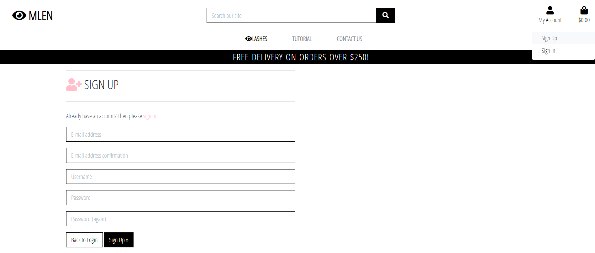

***receive confirmation emails throughout the registration process***

On pressing the Sign Up button, they are redirected to a Verify Your E-Mail Address screen. The user must then check their email and confirm their request to register.

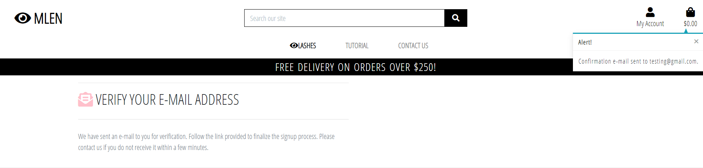

***log on and off the site after I have registered***

The user can login to the site by clicking the My Account icon in the top right of the screen and selects Sign In. The user is need to input their username and password. Form validation is present and once the user has filled up the information and clicked Sign In, they are redirected to the Home screen.

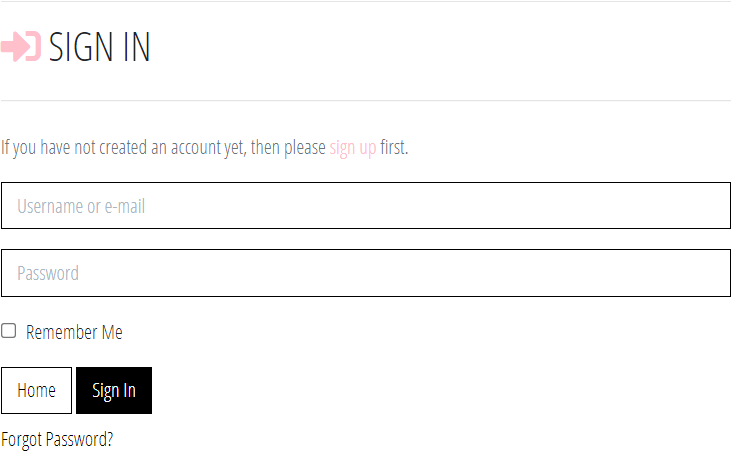

The user can logout of the site by clicking the My Account icon in the top right of the screen and selects Sign Out. The user is redirected to the Sign Out screen and is asked to confirm if they wish to log out. On clicking the Sign Out button they are redirected to the Home screen.

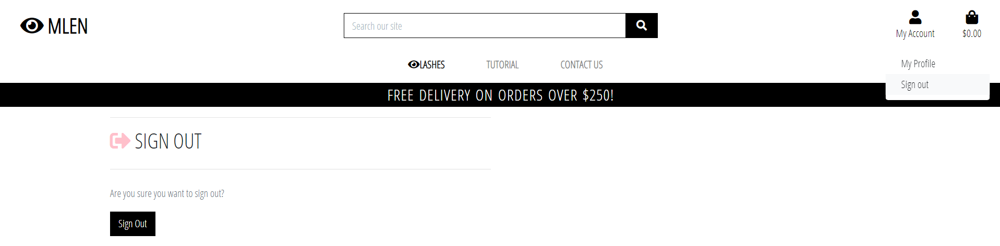

***recover my password if I no longer remember it.***

The user can recover their password, if forgotten, by clicking the `Forgot Password?` underneath the Sign In button. The user is asked to input their email address. On clicking the Reset My Password button, an email will be sent to their email address if it is in the database.

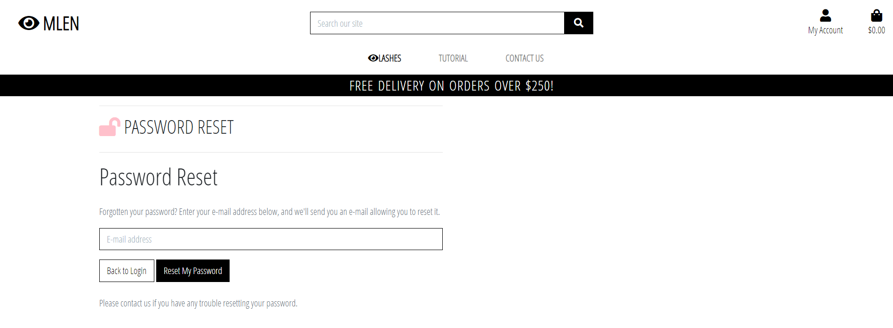

***have a interactive personalized user profile***

Registered user is able to view their profile by clicking the My Account button in the top right of the screen and selecting My Profile. The My Profile screen is divided in to two sections - Default Delivery Information on the right and Order History on the left. The user can update their delivery information and click the Update Info button. This information is then automatically filled in on the Checkout Screen for a better User Experience. Once orders are added to the site, they are saved in the database and are visible to the user. Clicking the order number brings the user to the order summary screen and a Toast lets them know this is a past order that they are viewing.

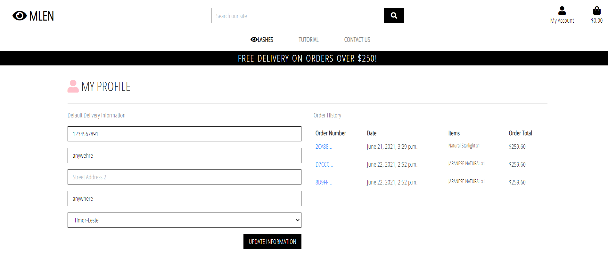

***view all the products.***

The user can access the Products screen by clicking the Shop Now button on the header image of the Homepage or by selecting Eyelashes from the navbar. The user is then presented with a card layout showing all the products on the site. Each card contains the product image, name, and price.

***view products by Sorting a specific category of product.***

The user is able to sort all products by selecting the filter box allows the user to view the products in alphabetical order and reverse order.

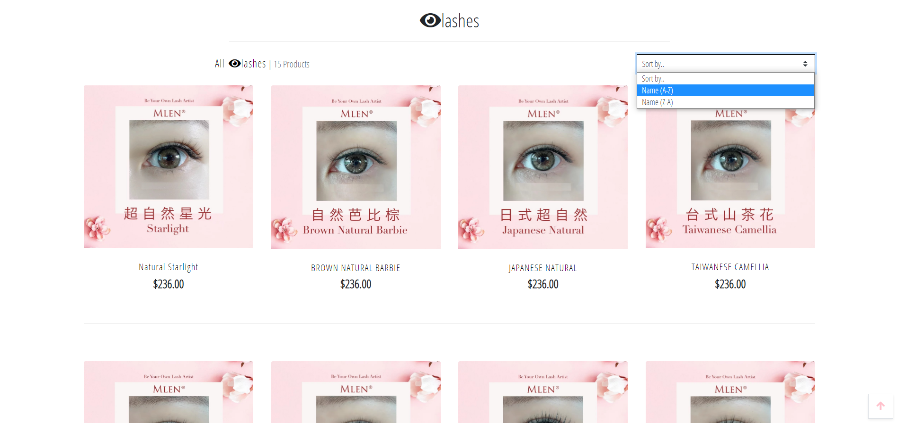

***search products by name.***

The user is able to search certain products by inputting keywords in the search bar.

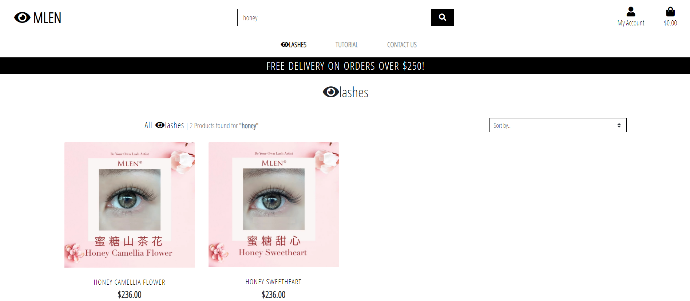

***see more detailed product information.***

On clicking a product image or name, the user is redirected to the relevant product-detil.html page. The product detail page contains the product information along with a more detailed description of the product. The user is able to add products to their basket through using the plus/minus buttons. The user is also able to continue shopping from this screen by clicking the Browse more Eyelashes button.

***add products to my cart easily.***

The user is able to add items to their bag by clicking the plus and minus buttons held within the Product Detail page.

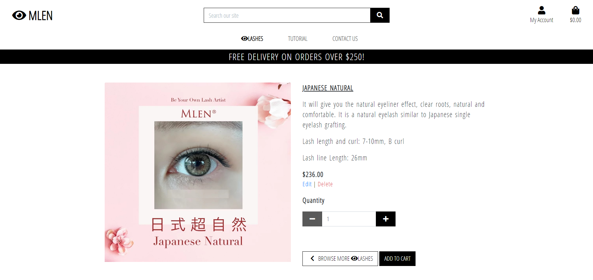

***add a review for a specific product.***

From an indiviudal items Product Detail page, the user is able to add a review for that product by typing in the message box at the bottom of the Product Detail page and clicking the submit button. The review is then displayed at the bottom of the Product Detail page.

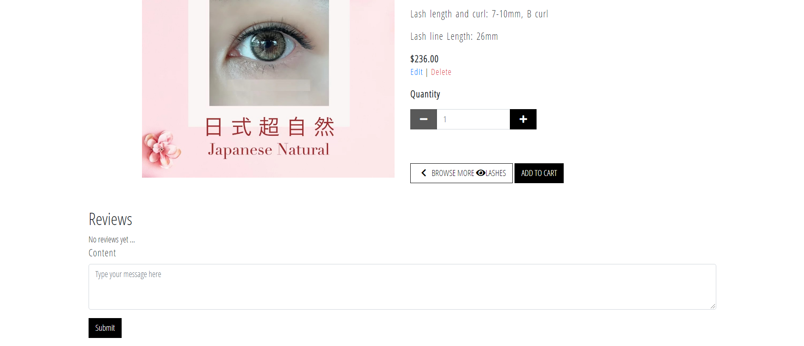

***easily view the total of my purchases anytime.***

Once items have been added to their bag, the user will be shown a Toast Success message confirming the items addition to the bag. Continued addition of items will increase the information contained in the Toast and the user will be able to scroll through their bag without having to leave the product screens. The user is also able to click the Go to Secure Checkout button to take them immediately to the full Shopping Bag page.

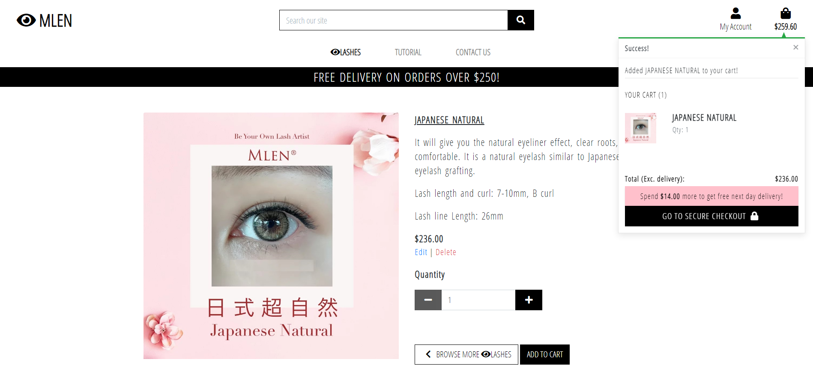

***view the items in my cart.***

The user clicks the basket icon in the top right of the page and is taken to the Shopping cart summary page.

***adjust the quantity of items in my cart.***

The user can alter the quantity of a specific product by clicking the plus/minus icons on either side of the input field, manually change the quantity within the field with keyboard input. This alters the quantity ordered value and must be confirmed by clicking the Update tag for it to be confirmed. Navigation buttons are visible to alow the user to either continue shopping or to move to the Checkout page.

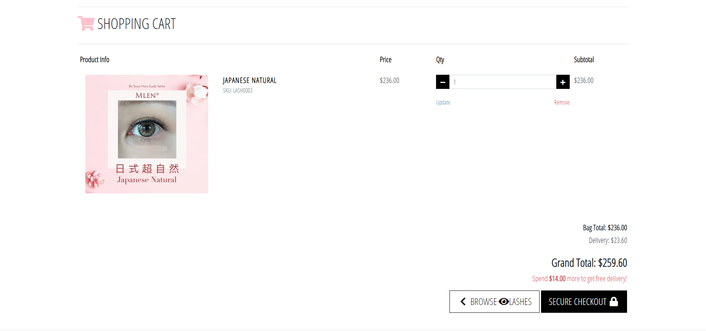

***easily enter my payment details.***

On the Checkout page they are presented with two sections that has delivery details on the left and order summary on the right. The delivery details will be pre-populate if the user has logged in with active account. If the user is not logged in, the order will still be processed but will be done as an Anonymous user. The user can login or register by clicking the link at the bottom of the screen and then back to the Shopping Basket. Credit card details are entered in to the bottom field and the field is validated using Stripe.

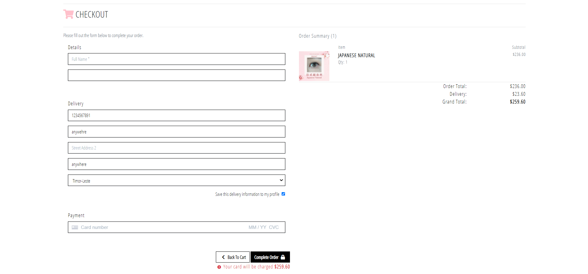

Clicking Complete Order will display a pink overlay screen and then take the user to the Checkout Success page. The user is able to return to the Shopping Bag page if they wish to amend the order before payment processing.

***view an order confirmation after checkout.***

Once the user has clicked the Complete Order button, they are directed to the Checkout Success page which shows a confirmation of their order along with their unique Order Number at the top of the page.

***receive an email confirmation after checking out.***

The user will too receive an email for their order after a successful checkout.

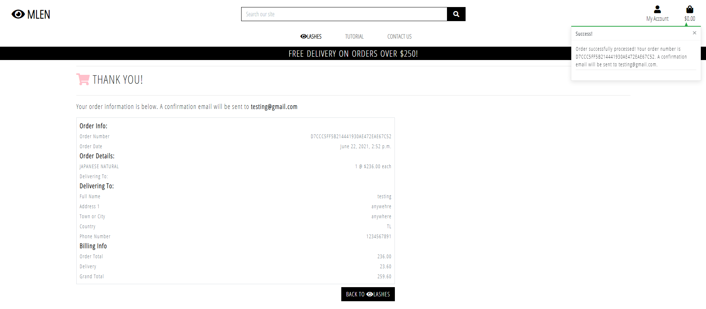

***send an email to the site.***

The user can access the Contact Us screen by clicking it on the navbar. The user will have to fill up the form before sending the message.

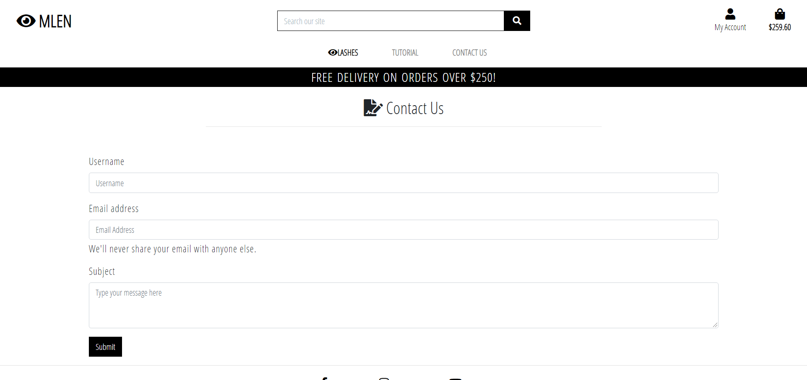

### As a site owner, I want to be able to -

***Add a product to the site.***

The site owner will be authorised as a SuperUser and will be able to access the Product Management part of the site by clicking the My Account on the main navbar. The site owner will be presented with a form that has mandatory fields that will need to be completed before the new product can be added to the DB. The Add Product button submits the form and the Cancel button returns the site owner to the products page.

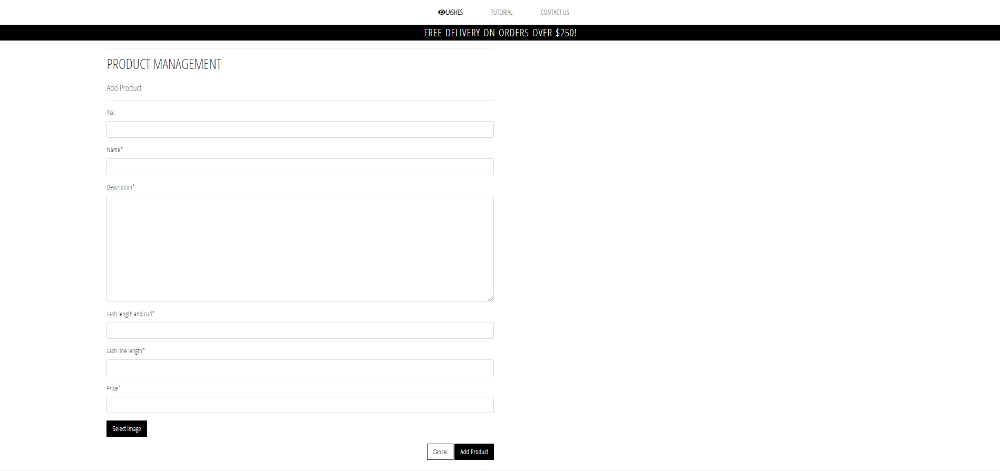

***Edit a product to the site.***

As a SuperUser, they will see the Edit/Delete tags underneath the product on the Eyelashes and Product Detail Page. By clicking the Edit tag, the user is redirected to the Edit Product form. This form is pre-populated with the prodcut informtion which the user can then alter and submit the changes to the DB.

***Delete a product from the site.***

As a SuperUser. The delete tag will sit underneath the relevant product in both the Eyelashes and Product Detail pages and on clicking will remove the product from the DB.

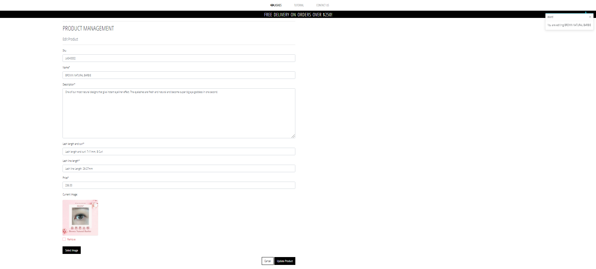

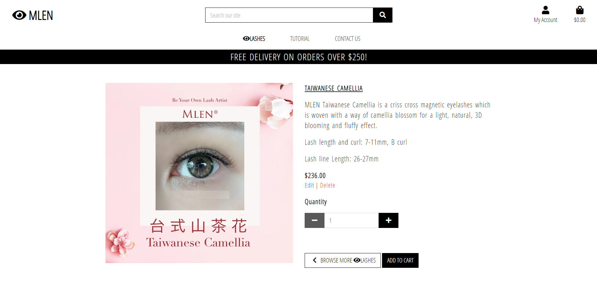